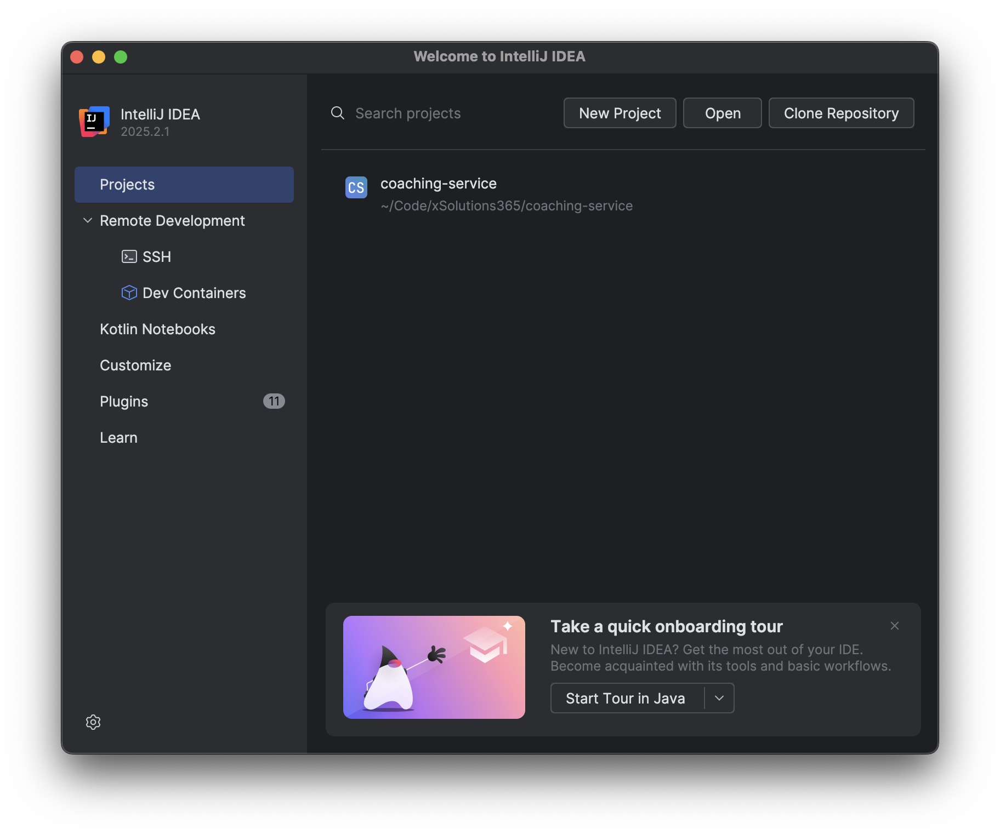
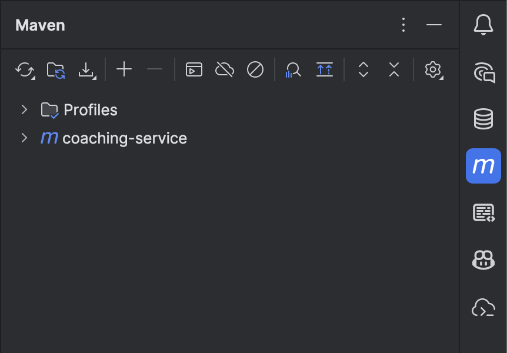
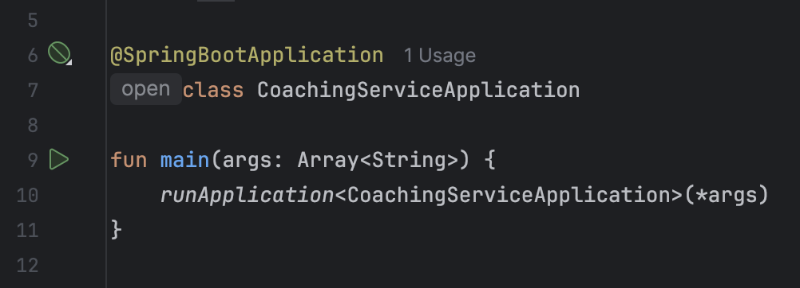
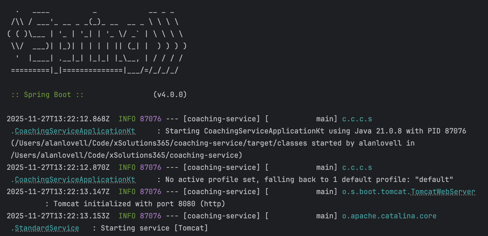

# Beginners Set up Guide

Hello, and welcome! This guide is designed to help you set up your development environment for the first time.

Assumptions:
- You are on MacOS
- You have [Homebrew](https://brew.sh/) installed
- You have Git installed and configured with your CreateFuture account

_Kotlin and Java Experience optional!_

## Step 0: Pull the project!

First, clone the repository to your local machine:

```bash
git clone https://github.com/xSolutions365/coaching-service
```

## Step 1: Set up SDKMan and Java

This project uses `Java 21` to build and run the application.


> **Why?**  
> SDKMan makes managing multiple versions of Java and other SDKs easy!  
> It also ensures that IntelliJ and any CLI tools use the same Java version, for more consistent behaviour.


### SDKMan installation

Install SDKMan by following the instructions on the [SDKMan website](https://sdkman.io/install).


### SDKMan installation via Homebrew
Alternatively, you can install SDKMan using Homebrew:

```bash
  brew tap sdkman/tap
  brew install sdkman-cli
```

Once that has been installed, run the following to append the SDKMan initialisation to your `~/.zshrc` file:
```bash
cat <<EOF >> ~/.zshrc
export SDKMAN_DIR=$(brew --prefix sdkman-cli)/libexec
[[ -s "${SDKMAN_DIR}/bin/sdkman-init.sh" ]] && source "${SDKMAN_DIR}/bin/sdkman-init.sh"
EOF

source ~/.zshrc
```

### Install Java 21

Once SDKMan is installed, install Java 21 using the following command:

```bash
  sdk install java 21.0.9-amzn
```

You can set this as your default version with `sdk default java 21.0.9-amzn`, or use it for the current terminal session with `sdk use java 21.0.9-amzn`.

Verify your installation by running:

```bash
  java -version
```

You should see `openjdk version "21.0.9" 2025-10-21 LTS` in the output.

## Step 2: Install IntelliJ

Download and install [IntelliJ Ultimate](https://www.jetbrains.com/idea/download/?section=mac).  
_You can also do this from the CreateFuture self-service portal!_

Apply the CreateFuture License by following [this guide](https://xsolutions.atlassian.net/wiki/spaces/ITSD/pages/2638839864/JetBrains+server+w.+Google+account).

> **Why?**  
> IntelliJ Ultimate has features that make working with Kotlin and Spring Boot easier.  
> You could achieve a similar thing with VSCode, but with more effort and a less slick "out of the box" experience.
> Using IntelliJ guarantees a reliable developer experience.


## Step 3: Set up the project in IntelliJ

Now we've got everything we need to work on the project, hopefully!

### Open the Project

Press the "Open" button, and select the folder where you cloned the repository.



### Select the correct JDK

When prompted, select the correct JDK (Java 21) for the project.

### Get Maven building



1. Click the `M` button in the sidebar to open the Maven panel.
2. Click the `Sync/Reload` icon, 
   - Reload the Maven project
3. Click the `Execute Maven Goal` button (it looks like a play button in a small window)
   - Enter `clean install` to build the project, and execute unit tests.

### Run the application


Open the [CoachingServiceApplication.kt](../../src/main/kotlin/com/createfuture/coaching/service/CoachingServiceApplication.kt) in IntelliJ. You should see a small play button next to the `main` function. Click this to run the application!



If all goes well, you should see output in the Run panel indicating that the application has started successfully.



From there, you should be able to hit the heartbeat endpoint to verify the server is up and running, and responding to requests.

`curl http://localhost:8080/api/heartbeat`

Or in your browser, navigate to `http://localhost:8080/api/heartbeat`.

## Next Steps

Now that you have the project set up, you can start exploring the codebase and making changes!
